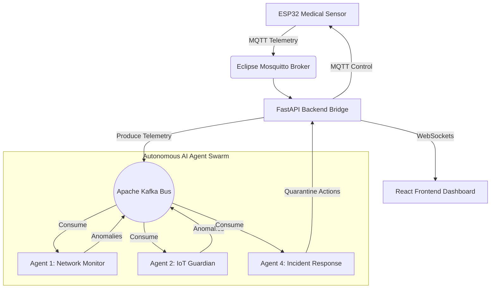

# MediSentinel Enterprise Cybersecurity Framework

An advanced, AI-driven, autonomous cybersecurity framework designed specifically to protect healthcare infrastructure and Medical IoT (IoMT) ecosystems in real-time.


## 🛡️ Core Features

- **Autonomous Multi-Agent AI Defense**: Operates a swarm of 5 distinct AI agents (Network Monitor, IoT Guardian, Threat Intelligence, Incident Response, and Compliance Auditor) that collaborate over a Kafka event bus.
- **Hardware-in-the-Loop Integration**: Native firmware for ESP32 microcontrollers to interface physical health sensors (MAX30100 Pulse Oximeter) directly into the defense grid.
- **Physical UI Syncing**: The ESP32 features a 160x128 TFT LCD that actively mirrors the backend AI agent mitigation logs and quarantine statuses in real-time.
- **Live React Dashboard**: A stunning glassmorphic UI displaying real-time hospital wing topologies, live WebSocket telemetry, network anomaly charts, and threat intelligence streams.
- **Zero-Touch Provisioning**: Automated deployment script that spins up the entire Docker microservice stack and flashes the C++ firmware to your ESP32 automatically.

## 🏗️ System Architecture



## 🚀 Quick Start Deployment

Deploying the entire infrastructure (including PostgreSQL, Redis, ZooKeeper, Kafka, MQTT, FastAPI, React, and the AI Agents) is fully automated.

1. **Connect Hardware (Optional):** Plug your ESP32 board (with MAX30100 sensor and ST7735 TFT display) into your computer via USB (`/dev/ttyUSB0`).
2. **Execute the Stack Runner:**
```bash
chmod +x run_stack.sh
./run_stack.sh
```

**The `run_stack.sh` script will automatically:**
1. Stop and clear any old running environments.
2. Build and launch all 10 Docker microservices.
3. Seed the PostgreSQL database with mock medical devices for the Hospital Map.
4. Detect your ESP32 device, compile the C++ firmware using PlatformIO, and flash it natively.

## 🌐 Services & Access Ports

Once the stack is running, you can access the core interfaces here:

- **Interactive Dashboard (React):** [http://localhost:3000](http://localhost:3000)
- **Backend API Docs (Swagger UI):** [http://localhost:8000/docs](http://localhost:8000/docs)
- **Live WebSocket Stream:** `ws://localhost:8000/ws`
- **MQTT Broker:** `localhost:1883`

## ⚔️ Triggering Attack Simulations

You can evaluate the Autonomous AI defense swarm by launching an active attack simulation against the system.

1. Open the **ML Management** tab in the Frontend Dashboard.
2. Click **Start Attack Simulation**.
3. Watch as the ESP32 physical LCD screen registers the attack (`ATTACK DETECTED`), and observe Agent 4 automatically quarantine the device, cutting off the malicious traffic visually on both the hardware and the web interface!

## 🔧 Environment Details
- **Frontend:** React 18, Vite, TypeScript, Recharts, Lucide Icons.
- **Backend:** Python 3.10, FastAPI, SQLAlchemy, asyncpg.
- **AI/ML:** Scikit-Learn (Isolation Forests, Autoencoders), PyTorch.
- **Hardware:** C++, PlatformIO, ArduinoJson, PubSubClient.
